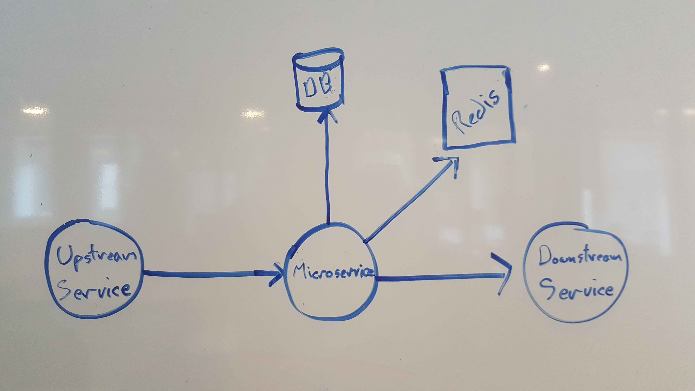

# Twixy

Microservices are a powerful way of quickly building scalable, high
performance, and robust cloud applications, but they have a huge
learning curve for two reasons:

1. Operational complexity: a microservices application is composed of many independently
   deployable units, and this makes your application a lot more
   complicated to run.

2. Development complexity: The business logic in a microservices application is distributed
   into a network of services. This requires your business logic (and
   hence its developers) to deal with a number of distributed systems
   problems that do not occur when your business logic is centralized
   in a monolith.

Operational complexity is being addressed by systems like Kubernetes and AWS Lambda.
But development complexity still remains.

The core problem is related dependencies, and in particular *remote* dependencies.
You can think of Microservices as Middlemen. They combine other remote
services such as datastores and/or *downstream* services in order to
offer a value-added service to their clients, or *upstream* services.



This composability makes them powerful, but also requires dealing with
a number of problems related to remote dependencies:

 - Remote dependencies might decide to throttle you. Your business
   logic needs to cope with this or suffer debilitating performance.

 - If your remote dependency isn't smart enough to throttle you (like
   a database), you need to protect it from becoming overloaded, or
   your performance will suffer.

 - Simple business logic when directly translated into remote network
   calls is usually slow because it expresses logic synchronously and
   sequentially. Networks are slow at this, they need control flow to
   be as asynchronous and as parallel as possible in order to perform
   well.

   For example:

    ```python
            result = []
            for comment in topic_comments():         # N is number of comments on a topic
              if karma(comment.user_id) > threshold: # L is latency of karma service
                result.append(comment)
    ```

    The total latency of code like this (N*L) is often to slow to be
    useful. So you need to either introduce aggressive caching into
    this code in order to eliminate the remote calls, or you need to
    restructure your code to issue all the remote requests in
    parallel, or often some combination of these strategies.

Experienced microservice developers have learned the hard way how to
deal with all these problems, and many blog posts have been written
about all the best practices and patterns you need to follow when
writing microservices.

Not only is this a lot to learn, but generally following all these best
practices involves a decent amount of boilerplate, and so as a newbie (and
sometimes even as an experienced microservices developer) you only bother when
it's too late.


## Twixy: Microservices development made easy

Twixy makes developing microservices easy by giving you a powerful server
skeleton that understands how to deal with remote dependencies at a
high level.

The Twixy framework implements the best practices needed for high-performance microservices.
Roughly these are:

  1. When a request arrives, determine if there is capacity to process
     it, and if not quickly throttle the request.

     *It may seem counter intuitive, but this technique (known as
      shedding-load/backpressure/flow-control/rate-limiting/throttling)
      is key to writing a high performance service.*

     *To understand why, it helps to remember that when an individual
      server becomes overloaded it will slow down, crash, and
      ultimately remove resources from the service as a whole. On the
      other hand if that same server sheds load, any clients that it
      refuses will either end up connecting to another existing server
      that has capacity, or to a new server that is brought online to
      deal with the extra load. The net result is, when an individual
      server stays within the limits where it can perform well, the
      service has a whole ends up with more resources.*

     *Doing this properly is more complex than it sounds, because as a
      middleman, you need to ensure that not only do you have
      sufficient capacity to handle the request, but all your required
      remote dependencies also have sufficient capacity to handle the
      request.*

  2. Assuming there is capacity, validate that the request is within
     permitted limits (e.g. not trying to query or insert a bazillion
     rows).

     *Even experienced microservice developers often only do this kind
      of defensive coding <b>after</b> production outages occur.*

  3. If the request is valid, then gather in parallel where possible,
     all remote information necessary to service the request with
     caching if/when desirable.

     a. for each *required* remote dependency retry if safe/necessary
        while also applying appropriate throttling to avoid self-DDoS

     b. for each *optional* remote dependency apply appropriate
        timeouts and then fallback to cached and/or dynamically
        computed default values

     *Doing this sort of parallel and/or short-circuited control flow
      usually requires extensive use of asynchronous APIs and often
      ends up in callback hell and complex control flow that is
      difficult to debug, however this is key to achieving high
      performance interactions with remote resources.*

  4. As soon as all the remote information is available, assemble and
     return the response.

  5. Log key performance metrics: number of successful requests,
     number of failed requests, and request latency.

While this is relatively straightforward to describe as a workflow in
English, business logic quickly ends up fragmented and mixed up with a
lot of glue when following these practices using standard tooling.

Twixy makes things simple.

You just declare all the tasks required to
process a response, including how each task should deal with remote
dependencies, and Twixy figures out the right order and does all the
load shedding, request validation, parallel information gathering,
short circuiting, and logging for you. Your business logic never needs
to deal with remote calls, asynchronous control flow, or error
conditions of any kind. It stays simple, comprehensible, **fast**,
and robust.

## How does it work?

Think of Twixy input as specifying a workflow or set of dependent
tasks necessary to process a request, along with deadlines, resource
constraints, and possible alternatives for these tasks.

### Hello Twixy

Here is a simple configuration file for Twixy. This says we have a
single *local* task that is *required* in order to produce a result,
and the latency should never be allowed to exceed 1 second.

<b>hello.twixy:</b>
```
request hello() -> result {
    task doit(result) -> result {
        type: local, required
        max-latency: 1s
    }
}
```

We use the twixy tool to generate our request workflow:

```
twixy build hello.twixy
```

Now we plug in our business logic and we're good to go:

```python
def doit():
    return "Hello World"
```

### Fetching Comments

Now let's try Twixy with the more complex request workflow from our
comments example. With this input, you can see how we describe both
the workflow for the request, and important information about how to
treat external dependencies all in one place:

<b>get_comments.twixy</b>
```
request get_comments(request) -> result {
    task query_comments(request) -> *comment {
        type: sql, required
        max-latency: 100ms
        max-rows: 1000
    }
    task request_karma(comment) ->  annotated_comment {
         type: http, optional
         max-latency: 10ms
         cache: true
         cache-ttl: 600s
         fallback: default_karma(comment)
    }
    task get_comments(request, *annotated_comment) -> result {
         type: local, required
         max-latency: 1s
    }
}
```

Again, we generate the request workflow with the twixy tool:

```
twixy build get_comments.twixy
```

Then fill in the business logic referenced in each workflow step:

```python
def query_comments(context, request):
    for comment in context.sql_query(... request.topic ...):
        yield comment

def request_karma(context, comment):
    return context.http_get(... comment.user_id ...)

def default_karma(context, comment):
    return 5

def get_comments(context, request, annotated_comments):
    result = []
    for comment in annotated_comments:
        if comment.karma > request.threshold:
            result.append(comment)
    return result
```

And that's it! We now have a high performance, robust, asynchronous
microservice.
